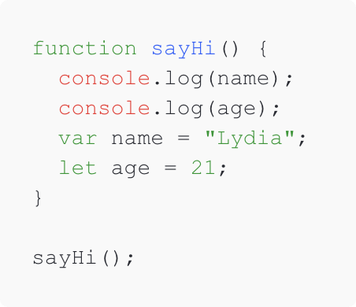

# javascript-questions-json
I parse [javascript-question](https://github.com/lydiahallie/javascript-questions) markdown to json on this project `dist` folder

```json
{
    "title": "1. What's the output?",
    "question": "function sayHi() {\n  console.log(name);\n  console.log(age);\n  var name = \"Lydia\";\n  let age = 21;\n}\n\nsayHi();\n",
    "options": ["A: `Lydia` and `undefined`", "B: `Lydia` and `ReferenceError`", "C: `ReferenceError` and `21`", "D: `undefined` and `ReferenceError`"],
    "answer": 3,
    "desc": "Within the function, we first declare the `name` variable with the `var` keyword. This means that the variable gets hoisted (memory space is set up during the creation phase) with the default value of `undefined`, until we actually get to the line where we define the variable. We haven't defined the variable yet on the line where we try to log the `name` variable, so it still holds the value of `undefined`.Variables with the `let` keyword (and `const`) are hoisted, but unlike `var`, don't get <i>initialized</i>. They are not accessible before the line we declare (initialize) them. This is called the \"temporal dead zone\". When we try to access the variables before they are declared, JavaScript throws a `ReferenceError`."
}
```

every question source code also convert a png file on `dist/pic` folder


